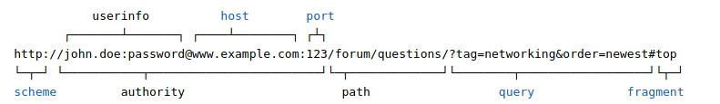

ვები

<!-- v -->
## გამეორება - რა არის ინტერნეტი

<!-- s -->

# რა არის ვები

<!-- n -->
[შექმნის მოტივაცია](https://webfoundation.org/about/vision/history-of-the-web/)

<!-- v -->

## რისგან შედგება
- სერვერები
- კლიენტები

<!-- n -->
ერთი და იგივე კომპიუტერზე შეიძლება იყოს რამდენიმე სერვერი და კლიენტი. 
<!-- v -->

### სერვერი
ნებისმიერი კომპიუტერი, სადაც არის რესურსი
- ფაილი
- მესიჯი/ინფორმაცია
- გენერირებული საიტი
- პროგრამა, რომელიც საიტს აგენერირებს

<!-- v -->

### კლიენტი
- ბრაუზერი
- აპლიკაცია
- სხვა პროგრამა

<!-- s -->

## მთავარი კომპონენტები
- HTML
- URI/URL
- HTTP

<!-- n -->
ქსელი უკვე დიდი ხანია არსებობდა, მაგრამ ყველა ორ კომპიუტერს შორის პროგრამული კავშირი არ იყო იმდენად მარტივი

<!-- v -->

### HTML
ტექსტის ფორმატირების ენა (არა პროგრამული)
<!-- n -->
HyperText Markup Language. The markup (formatting) language for the web.
ფაილების ფორმატი (შეეძლოთ ვორდი აერჩიათ)
<!-- v -->

### HTTP
რესურსების მიმოცვლის პროტოკოლი (TCP/IP-ის ზედა შრე)
თავიდან html ფაილები და მისი შემადგენელი ნაწილები, მაგრამ ახლა ვები უფრო მეტს მოიცავს

<!-- n -->
Hypertext Transfer Protocol. Allows for the retrieval of linked resources from across the web.

### HTTP სპეციფიკაცია

- request/response
- status codes (404)
- stateless (არაფერი ვიცით წინა კავშირის შესახებ)

<!-- v -->

### URL/URI - მისამართი
უნიკალური იდენთიფიკატორი

<!-- n -->
Uniform Resource Identifier. A kind of “address” that is unique and used to identify to each resource on the web. It is also commonly called a URL.
პორტი: ვირტუალური 'კარები'

<!-- s -->

## მთავარი იდეები

<!-- v -->

## დეცენტრალიზაცია
<!-- n -->
No permission is needed from a central authority to post anything on the web, there is no central controlling node, and so no single point of failure … and no “kill switch”! This also implies freedom from indiscriminate censorship and surveillance.

<!-- v -->

## თანასწორობა - არანაირი დისკრიმინაცია

<!-- n -->
If I pay to connect to the internet with a certain quality of service, and you pay to connect with that or a greater quality of service, then we can both communicate at the same level. This principle of equity is also known as Net Neutrality.

<!-- v -->

## საზოგადოებასთან ჩართულობა

<!-- n -->
Instead of code being written and controlled by a small group of experts, it was developed in full view of everyone, encouraging maximum participation and experimentation.

<!-- v -->

## უნივერსალურობა / თავისუფლება

<!-- n -->
For anyone to be able to publish anything on the web, all the computers involved have to speak the same languages to each other, no matter what different hardware people are using; where they live; or what cultural and political beliefs they have. In this way, the web breaks down silos while still allowing diversity to flourish.

<!-- v -->

## კონსესუსი
<!-- n -->
For universal standards to work, everyone had to agree to use them. Tim and others achieved this consensus by giving everyone a say in creating the standards, through a transparent, participatory process at W3C.

